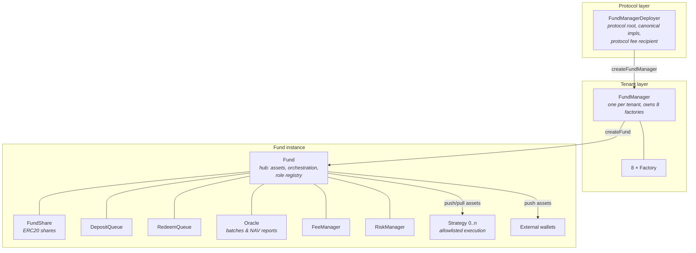
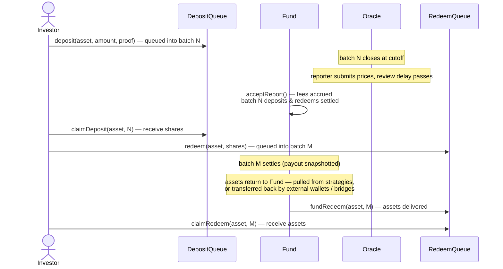

# Red Potion Contracts

Red Potion is a **multi-tenant, on-chain asset-management protocol**. It lets a protocol operator onboard tenants (fund houses), each of which can launch any number of **tokenized funds**. Investors deposit assets into batched queues, receive ERC20 fund shares priced by operator-submitted NAV reports, and redeem back into assets — while fund operators deploy capital through allowlisted strategy wallets under configurable risk limits and fee schedules.

Built with [Foundry](https://book.getfoundry.sh/), Solidity `0.8.34`, and OpenZeppelin v5 upgradeable contracts. Everything is deployed behind `TransparentUpgradeableProxy`. License: BUSL-1.1.

## System architecture

Three layers: a **protocol root**, per-tenant **fund launchpads**, and per-fund **hub-and-spoke** instances.



**Star architecture.** The [Fund](docs/Fund.md) is the hub: spokes never talk to each other, only to the Fund. Spokes also hold no role state — their admin functions authorize via a callback to the Fund's access control, so all roles for a fund are managed in one place (see [Access Control & Roles](docs/AccessControl.md)).

**Batch-based lifecycle.** There is no continuous AMM-style pricing. The [Oracle](docs/Oracle.md) divides time into batches with cutoff times. Deposits and redemptions queue into the current batch; an off-chain reporter submits per-asset prices after cutoff; after a mandatory review delay the report is accepted, which settles all deposit and redeem batches at a single fair price and accrues fees — all in one `Fund.acceptReport` transaction.

## Contracts

Each deployed contract has a detailed doc covering its responsibility, flows, and full function reference:

| Contract | Doc | One-liner |
|---|---|---|
| `FundManagerDeployer` | [docs/FundManagerDeployer.md](docs/FundManagerDeployer.md) | Protocol root: creates tenants, holds canonical implementations and the protocol fee recipient. |
| `FundManager` | [docs/FundManager.md](docs/FundManager.md) | Per-tenant launchpad: creates complete funds and fund strategies via its 8 factories. |
| `Factory` | [docs/Factory.md](docs/Factory.md) | Generic transparent-proxy factory + entity registry, reused everywhere. |
| `Fund` | [docs/Fund.md](docs/Fund.md) | Hub of a fund: holds assets, orchestrates settlement, central role registry, strategy/external-wallet management. |
| `FundShare` | [docs/FundShare.md](docs/FundShare.md) | ERC20 share token; mint/burn only by the Fund. |
| `DepositQueue` | [docs/DepositQueue.md](docs/DepositQueue.md) | Batched deposit requests: deposit → cancel/settle → claim shares. |
| `RedeemQueue` | [docs/RedeemQueue.md](docs/RedeemQueue.md) | Batched redemptions: redeem → settle (payout snapshot) → fund → claim assets. |
| `Oracle` | [docs/Oracle.md](docs/Oracle.md) | Batch clock + NAV price reports with suspicious-price safety checks and accept windows. |
| `FeeManager` | [docs/FeeManager.md](docs/FeeManager.md) | Entry/exit/management/performance/protocol fees, paid in minted shares; high-water mark. |
| `RiskManager` | [docs/RiskManager.md](docs/RiskManager.md) | Deposit/redeem guardrails: TVL & batch caps, minimums, drawdown gate, merkle whitelist, emergency pause. |
| `Strategy` | [docs/Strategy.md](docs/Strategy.md) | Fund-controlled execution wallet limited to an allowlist of (caller, target, selector[, pinned calldata]) calls. |
| `StandaloneStrategy` / `StandaloneStrategyDeployer` | [docs/StandaloneStrategy.md](docs/StandaloneStrategy.md) | The same execution engine, detached from Fund control — for deploying fund strategies **on other chains** (assets bridged externally, results reflected via oracle NAV). |

Cross-cutting reference: [Access Control & Roles](docs/AccessControl.md) — the two auth patterns, the full role table, and the upgrade-authority model.

## Investor lifecycle at a glance



Key conventions:

- **Prices** are 1e18-scaled "asset per share": `shares = amount * 1e18 / price`.
- **Native ETH** is supported everywhere assets are handled, via the sentinel `0xEeeeeEeeeEeEeeEeEeEeeEEEeeeeEeeeeeeeEEeE`.
- **Fees are paid in newly minted shares**, never in assets.
- Requests are **cancellable until their batch settles**; claims never expire.

## Repository layout

```
src/
├── *.sol                 # 13 deployed contracts (see table above)
├── interfaces/           # One interface per contract + module interfaces
├── libraries/            # AssetSet (array union), TransferHelper (ERC20+ETH transfers)
└── modules/              # Composable behavior mixed into Fund / Strategy / spokes
script/
├── DeployInfra.s.sol     # Deploys implementations + FundManagerDeployer proxy
├── upgrade-impls.sh      # Redeploy impls & upgrade live proxies interactively
├── verify-*.sh           # Etherscan verification per network
└── Log*.s.sol            # Introspection helpers (impl addresses, proxy owners)
deployments/              # Per-network deployed addresses (JSON)
test/                     # Foundry tests
lib/                      # Dependencies (OpenZeppelin upgradeable, forge-std)
```

## Deployments

Current deployments live in [`deployments/`](deployments/): [`mainnet.json`](deployments/mainnet.json) and [`base-sepolia.json`](deployments/base-sepolia.json). The entrypoint address is `fundManagerDeployer`; the rest are implementation addresses.

## Development

```shell
# Build
forge build

# Test
forge test

# Format
forge fmt

# Deploy infrastructure (writes deployments/$NETWORK.json)
NETWORK=base-sepolia forge script script/DeployInfra.s.sol \
  --rpc-url base-sepolia --broadcast

# Verify on Etherscan
./script/verify-base-sepolia.sh

# Upgrade implementations on a live network
./script/upgrade-impls.sh
```

RPC endpoints and Etherscan keys are configured via `MAINNET_RPC_URL`, `BASE_SEPOLIA_RPC_URL`, and `ETHER_SCAN_API_KEY` env vars (see [`foundry.toml`](foundry.toml)).
