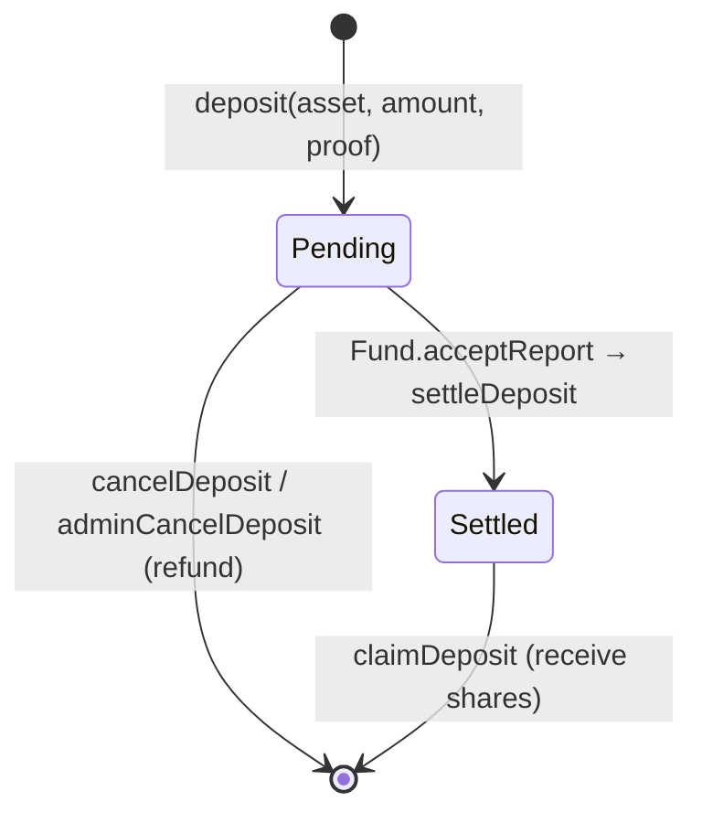

# DepositQueue

> Source: [`src/DepositQueue.sol`](../src/DepositQueue.sol)

## Responsibility

`DepositQueue` is the **user entrypoint for depositing into a fund**. Deposits are not instant — they are queued into the current **batch** and converted to shares only when the batch's oracle report is accepted (see [Oracle](Oracle.md) for batch semantics). This gives every depositor in a batch the same execution price and lets the operator screen prices before settlement.

It supports multiple deposit assets (ERC20s and native ETH via the `0xEeee…EEeE` sentinel), per-asset and global pausing, cancellation before settlement, and pro-rata claiming after settlement.

Admin functions authorize against the **Fund's** access control (spoke pattern — see [AccessControl.md](AccessControl.md)).

## Deposit lifecycle

1. **Request** — user calls `deposit`. The queue asks the Fund for the current batch id, runs `Fund.checkDeposit` → [RiskManager](RiskManager.md) (whitelist, caps, minimums), then escrows the assets. One request per (asset, batch, user); depositing again in the same batch reverts.
2. **Cancel** — the user can cancel their **current-batch** request any time before settlement and get a full refund. An admin (`CANCEL_DEPOSIT_REQUEST_ROLE`) can cancel any user's request in any *unsettled* batch (e.g. stuck past batches).
3. **Settle** — during `Fund.acceptReport` the Fund mints the batch's user shares *to the queue* and calls `settleDeposit`, which transfers all escrowed assets of that batch to the Fund.
4. **Claim** — the user calls `claimDeposit` and receives `depositAmount * batchShareTotals / batchDepositTotals` (pro-rata share of the batch mint). No deadline; claims stay available indefinitely.

## Function reference

### User actions

| Function | Access | Description |
|---|---|---|
| `deposit(asset, amount, proof)` | anyone (payable) | Queue a deposit into the current batch. `proof` is the merkle whitelist proof (empty if no whitelist configured). For ETH, `msg.value` must equal `amount`; for ERC20s, `msg.value` must be 0 and the queue pulls via `transferFrom`. Reverts if asset not allowed, asset or queue paused, amount 0, or a request already exists for this batch. |
| `cancelDeposit(asset)` | request owner | Cancel own current-batch request, full refund. |
| `claimDeposit(asset, batchId)` | request owner | Claim pro-rata shares after the batch is settled. |

### Fund actions

| Function | Access | Description |
|---|---|---|
| `settleDeposit(asset, batchId, sharesToMint)` | `onlyFund` | Marks the batch settled, records `batchShareTotals` for pro-rata claims, and transfers all escrowed assets of the batch to the Fund. Reverts if already settled. |

### Admin (roles checked on the Fund)

| Function | Role | Description |
|---|---|---|
| `setAllowedAssets(assets[])` | `SET_DEPOSIT_ALLOWED_ASSETS_ROLE` | Replaces the allowed-asset list. Reverts if a removed asset still has pending requests in the current batch. Duplicates and zero addresses rejected. |
| `pause()` / `unpause()` | `PAUSE_DEPOSIT_ROLE` / `UNPAUSE_DEPOSIT_ROLE` | Global pause — blocks `deposit`, `cancelDeposit`, and `claimDeposit`. |
| `pauseAssets(assets[])` / `unpauseAssets(assets[])` | `PAUSE_DEPOSIT_ROLE` / `UNPAUSE_DEPOSIT_ROLE` | Per-asset pause — blocks new deposits of those assets only. |
| `adminCancelDeposit(asset, batchId, user)` | `CANCEL_DEPOSIT_REQUEST_ROLE` | Cancel any user's request in any unsettled batch; assets are refunded to the user. |
| `pullAsset(asset, amount)` | `PULL_DEPOSIT_ASSET_ROLE` | Escape hatch: transfer assets from the queue to the Fund (e.g. tokens sent by mistake). Always sends to the Fund, never an arbitrary address. |

### Views

| Function | Description |
|---|---|
| `getAllowedAssets()` | Current allowed deposit assets. |
| `getAssetStatuses()` | Allowed assets with their per-asset pause flag. |
| `getDepositRequest(asset, batchId, investor)` | A single request (`amount`, `timestamp`). |
| `getPendingDeposits(investor)` | The investor's requests in the **current** batch. |
| `getClaimableDeposits(investor)` | The investor's requests in past, **settled** batches (claimable now). |
| `batchDepositTotals(asset, batchId)` | Total deposited per asset per batch (public mapping). |
| `batchShareTotals(asset, batchId)` | Total shares minted for the batch (set at settlement). |
| `isAssetPaused(asset)` | Per-asset pause flag. |
| `fund()` | The bound Fund. |
