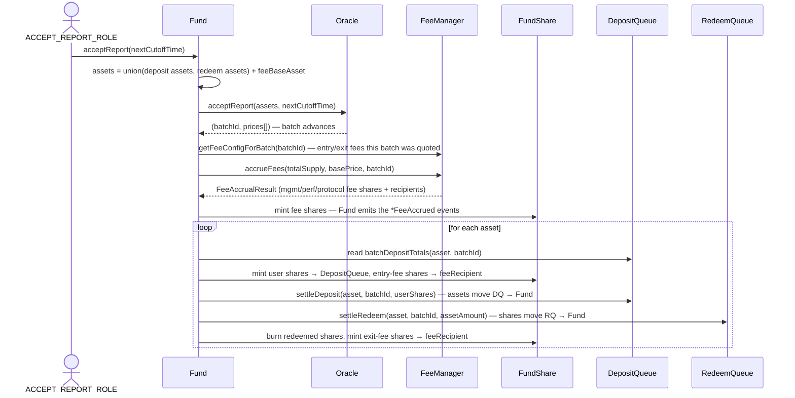

# Fund

> Source: [`src/Fund.sol`](../src/Fund.sol) · Modules: [`src/modules/`](../src/modules/)

## Responsibility

`Fund` is the **hub of a fund instance** (star architecture). It is the central orchestrator that:

- Holds the fund's assets (ERC20s and native ETH) and pushes/pulls them to strategies and external wallets.
- Orchestrates **batch settlement**: accepting an oracle price report, accruing fees, settling deposit and redeem batches in a single transaction.
- Acts as the **access-control registry** for the whole fund: every spoke (queues, oracle, fee manager, risk manager) authorizes admin calls by checking roles against the Fund's `AccessControl` state (see [Access Control](AccessControl.md)).
- Mediates all spoke-to-spoke communication — spokes only know the Fund, never each other.

The Fund contract itself is thin; most behavior comes from the modules it composes:

| Module | What it contributes |
|---|---|
| `FundACLModule` / `FundRoles` | Role registry + all role name constants (`SET_FEES_ROLE`, …) |
| `QueueModule` | Stores `share`/`depositQueue`/`redeemQueue` addresses, settlement math and internals |
| `OracleModule` | Stores `oracle` address, batch-id passthrough, accept-report internals |
| `FeeManagerModule` | Stores `feeManager` address, fee accrual internals |
| `RiskManagerModule` | Queue-facing `checkDeposit`/`checkRedeem` proxies to RiskManager |
| `StrategyModule` | Strategy registry + asset push/pull to [Strategy](Strategy.md) contracts |
| `ExternalWalletModule` | Whitelist of external wallets + asset push |

All module state uses ERC-7201 namespaced storage (`neobank.storage.*`) to stay upgrade-safe.

## Key flows

### Settlement flow (`acceptReport`)

Fees accrue **once, before any queue settlement**, so the management/performance fee base is the share supply that was invested over the elapsed period — this batch's deposit mints and redeem burns cannot leak into it. Entry/exit fees are read via `FeeManager.getFeeConfigForBatch(batchId)` before accrual (accrual promotes staged fee configs, after which the batch's rates would no longer be resolvable) — see the fee config lifecycle in [FeeManager](FeeManager.md). The FeeManager only computes; the Fund mints all fee shares and emits every accrual event: `ManagementFeeAccrued` / `PerformanceFeeAccrued` / `ProtocolFeeAccrued` once per settlement, and `EntryFeeAccrued` / `ExitFeeAccrued` per asset as each queue batch settles.

Share math (in `QueueModule`):
- Deposit: `totalShares = depositAmount * 1e18 / price`, entry fee = `totalShares * entryFeeBps / 10000`, user gets the rest.
- Redeem: exit fee = `redeemShares * exitFeeBps / 10000`, payout = `netShares * price / 1e18`. The payout amount is **snapshotted** in the RedeemQueue at settlement time, so later fee/price changes cannot desynchronize accounting.

### Redeem funding flow

Settlement only *records* how much each redeem batch is owed. Actually paying it out is a second, role-gated step, because at settlement time the fund's assets are typically deployed elsewhere and must first return to the Fund. There are two ways assets come back:

- **From strategies** — `pullAssetFromStrategy` (`PULL_FROM_STRATEGY_ROLE`): the Fund pulls the assets back itself; a [Strategy](Strategy.md) can never refuse a pull.
- **From external wallets** — the wallet's controller transfers assets back to the Fund address with a plain transfer. The Fund cannot pull from an external wallet (see `pushAssetToWallet` above); this leg is operational trust in the wallet controller. The same applies to capital deployed cross-chain via [StandaloneStrategy](StandaloneStrategy.md) — it is bridged back to the Fund externally.

Once the Fund holds enough of the payout asset:

1. `fundRedeem(asset, batchId)` — transfers the snapshotted `batchAssetTotals` amount to the RedeemQueue and marks the batch funded.
2. Users call `RedeemQueue.claimRedeem`.

## Function reference

### Initialization

| Function | Access | Description |
|---|---|---|
| `initialize(share, depositQueue, redeemQueue, oracle, feeManager, riskManager, fundManager, admin, roleHolders[])` | initializer (called by [FundManager](FundManager.md) during `createFund`) | Wires all spoke addresses, grants `DEFAULT_ADMIN_ROLE` to `admin` and any extra roles in `roleHolders`. |
| `receive()` | anyone | Accepts native ETH (needed for ETH-denominated funds). |

### Orchestrated entrypoints

| Function | Access | Description |
|---|---|---|
| `acceptReport(nextCutoffTime)` | `ACCEPT_REPORT_ROLE` | Accepts the pending oracle report for **all** allowed assets (union of deposit + redeem assets + fee base asset), then settles every asset's deposit and redeem batch and accrues fees. Reverts if any pending report is flagged suspicious. |
| `acceptSuspiciousReport(nextCutoffTime)` | `ACCEPT_SUSPICIOUS_REPORT_ROLE` | Same as `acceptReport` but bypasses the suspicious-price check. Intended for a more privileged operator after manual review. |
| `fundRedeem(asset, batchId)` | `FUND_REDEEM_ROLE` | Transfers the snapshotted payout amount for a settled redeem batch to the RedeemQueue and marks it funded/claimable. |

### Views

| Function | Description |
|---|---|
| `protocolFeeRecipient()` | Live-resolves the protocol fee recipient via `FundManager → FundManagerDeployer`. |
| `getRiskContext(asset, batchId)` | Aggregates everything [RiskManager](RiskManager.md) needs for a check: base/asset prices, high-water mark, entry/exit fee bps (quoted from the fee config effective for the batch currently open for requests), share supply, and the batch's deposit/redeem totals valued in the base asset. |
| `share()` / `depositQueue()` / `redeemQueue()` / `oracle()` / `feeManager()` / `fundManager()` | Spoke addresses. |
| `getCurrentBatchId()` | Passthrough to `Oracle.getCurrentBatchId()`. Queues read this through the Fund so they never need to know the Oracle. |
| `getSettlingBatch()` | The batch awaiting settlement and its cutoff time (from the Oracle). Used by the queues' cancel-lock and force-cancel logic. |
| `isStrategy(strategy)` | Whether an address is a registered strategy. |
| `isExternalWallet(wallet)` / `getExternalWallets()` | External wallet whitelist. |

### Queue-facing validation (called by queues, view)

| Function | Description |
|---|---|
| `checkDeposit(depositor, asset, batchId, amount, proof)` | Proxied to `RiskManager.checkDeposit`. The queue passes the end user as `depositor` so the merkle whitelist applies to the real depositor. Reverts on any violated limit. |
| `checkRedeem(batchId, shares)` | Proxied to `RiskManager.checkRedeem`. |

### Strategy management (`StrategyModule`)

| Function | Access | Description |
|---|---|---|
| `createStrategy(admin, roleHolders[])` | `CREATE_STRATEGY_ROLE` | Asks the FundManager to deploy a new [Strategy](Strategy.md) proxy bound to this fund, and registers it. |
| `addStrategy(strategy)` | `ADD_STRATEGY_ROLE` | Registers an existing strategy. The strategy's `fund()` must be this Fund. |
| `removeStrategy(strategy)` | `REMOVE_STRATEGY_ROLE` | De-registers a strategy (blocks further pushes/pulls). |
| `pushAssetToStrategy(strategy, asset, amount)` | `PUSH_TO_STRATEGY_ROLE` | Transfers assets from the Fund to a registered strategy. |
| `pullAssetFromStrategy(strategy, asset, amount)` | `PULL_FROM_STRATEGY_ROLE` | Calls `strategy.pullAsset` to bring assets back to the Fund. |

### External wallets (`ExternalWalletModule`)

For custody destinations that are not smart-contract strategies — user-controlled wallets outside the protocol's reach (e.g. CEX deposit addresses, custodian accounts).

| Function | Access | Description |
|---|---|---|
| `addExternalWallet(wallet)` | `ADD_EXTERNAL_WALLET_ROLE` | Whitelists a wallet. |
| `removeExternalWallet(wallet)` | `REMOVE_EXTERNAL_WALLET_ROLE` | Removes a wallet from the whitelist. |
| `pushAssetToWallet(wallet, asset, amount)` | `PUSH_TO_WALLET_ROLE` | Transfers fund assets to a whitelisted wallet. **One-way by design** — the wallet is user-controlled, so there is no on-chain pull; only the wallet's controller can transfer the assets back to the Fund. |

### Role administration (`ACLModule`)

| Function | Access | Description |
|---|---|---|
| `grantRoles(roleHolders[])` / `revokeRoles(roleHolders[])` | `DEFAULT_ADMIN_ROLE` | Batch grant/revoke of any fund role. Standard OZ `grantRole`/`revokeRole`/`hasRole`/`getRoleMember*` are also available. |
| `multicall(bytes[])` | anyone (per-call auth still applies) | OZ Multicall batching. |

See [AccessControl.md](AccessControl.md) for the full role table.
