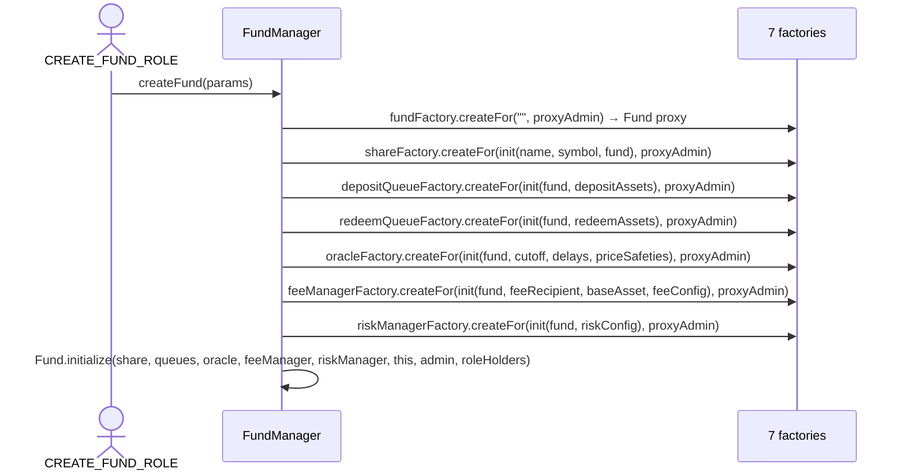

# FundManager

> Source: [`src/FundManager.sol`](../src/FundManager.sol)

## Responsibility

`FundManager` is a **tenant-level fund launchpad**. One FundManager is created per tenant/organization (by the [FundManagerDeployer](FundManagerDeployer.md)), and it can create any number of funds. It owns eight [Factory](Factory.md) instances — one per component — and wires a complete fund (hub + six spokes) in a single `createFund` transaction.

It also:

- Deploys [Strategy](Strategy.md) proxies on behalf of its funds (`createStrategyForFund`).
- Lets role holders **swap factories or upgrade the implementation** used for future components, per component type.
- Forwards the protocol fee recipient from the FundManagerDeployer down to funds (`protocolFeeRecipient()`), so [FeeManager](FeeManager.md) can resolve it live.

It has its own `ACLModule` access control (independent of any fund's roles).

## Fund creation flow

Notes:

- The Fund proxy is created **uninitialized first** so every spoke can be initialized with its address; the Fund is initialized last with all spoke addresses.
- Every proxy's ProxyAdmin is owned by `params.proxyAdmin` — the tenant controls upgrades of everything belonging to its funds.
- `CreateFundParams` bundles: `admin`, `proxyAdmin`, `feeRecipient`, `feeBaseAsset`, share name/symbol, deposit/redeem asset lists, first cutoff time, report delays, price safeties, fee config, risk config, and initial role holders.

## Function reference

### Fund creation

| Function | Access | Description |
|---|---|---|
| `initialize(owner, deployer, …8 factories…, roleHolders[])` | initializer (via FundManagerDeployer) | Wires the factories and the parent deployer; grants `DEFAULT_ADMIN_ROLE` to `owner`. |
| `createFund(params)` | `CREATE_FUND_ROLE` | Deploys and wires a complete fund as above. Returns all seven component addresses. |
| `createStrategyForFund(fund, admin, roleHolders[])` | callable **only by a Fund this manager created** (`msg.sender == fund && fundFactory.isEntity(fund)`) | Deploys a Strategy proxy bound to that fund. The strategy's ProxyAdmin owner is set to the same owner as the **fund's** ProxyAdmin, so the tenant can upgrade both together. Reached via `Fund.createStrategy`. |

### Factory / implementation management

One pair per component type, each guarded by its own role (`SET_FUND_FACTORY_ROLE`, `SET_SHARE_FACTORY_ROLE`, `SET_DEPOSIT_QUEUE_FACTORY_ROLE`, `SET_REDEEM_QUEUE_FACTORY_ROLE`, `SET_ORACLE_FACTORY_ROLE`, `SET_FEE_MANAGER_FACTORY_ROLE`, `SET_RISK_MANAGER_FACTORY_ROLE`, `SET_STRATEGY_FACTORY_ROLE`):

| Function pattern | Description |
|---|---|
| `set<Component>Factory(address)` | Replace the factory used for future funds (e.g. `setOracleFactory`). |
| `set<Component>Implementation(address)` | Push a new implementation into the current factory (`factory.setImplementation`), affecting future creations only (e.g. `setOracleImplementation`). |

Existing fund proxies are **not** affected by either — they are upgraded through their own ProxyAdmins.

### Views

| Function | Description |
|---|---|
| `fundFactory` / `shareFactory` / `depositQueueFactory` / `redeemQueueFactory` / `oracleFactory` / `feeManagerFactory` / `riskManagerFactory` / `strategyFactory` | The eight factories (each also serves as the registry of entities of that type). |
| `deployer` | The parent FundManagerDeployer. |
| `protocolFeeRecipient()` | Live lookup of the protocol fee recipient from the deployer. |
