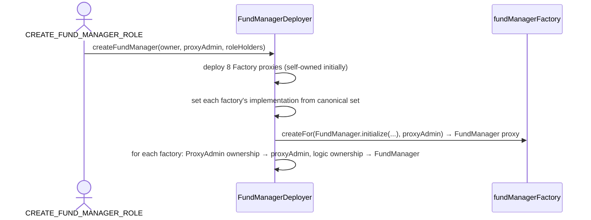

# FundManagerDeployer

> Source: [`src/FundManagerDeployer.sol`](../src/FundManagerDeployer.sol)

## Responsibility

`FundManagerDeployer` is the **protocol root** — the single contract the protocol team deploys and operates. It:

- Holds the **canonical implementation addresses** for every contract type in the system (Factory, FundManager, Fund, FundShare, DepositQueue, RedeemQueue, Oracle, FeeManager, RiskManager, Strategy).
- Creates **[FundManager](FundManager.md)s** (one per tenant), each with its own fresh set of eight component [factories](Factory.md).
- Stores the **protocol fee recipient**, which every fund's [FeeManager](FeeManager.md) resolves live at fee-accrual time (`FeeManager → Fund → FundManager → deployer`). Changing it here immediately applies to all funds across all tenants.

It has its own `ACLModule` access control. It is deployed behind a proxy itself by [`script/DeployInfra.s.sol`](../script/DeployInfra.s.sol).

## Tenant creation flow (`createFundManager`)

The result per tenant:

- **`owner`** gets `DEFAULT_ADMIN_ROLE` on the FundManager (grants `CREATE_FUND_ROLE` etc.).
- **`proxyAdmin`** owns the ProxyAdmins of the FundManager proxy and all eight factory proxies (and later, via `createFund`, of every fund component) — full upgrade authority over the tenant's contracts.
- The **FundManager** owns the factories' logic (`Ownable`), so only it can call `create`/`setImplementation` on them.

ProxyAdmin addresses are computed deterministically: in OZ v5 a `TransparentUpgradeableProxy` deploys its ProxyAdmin as its first CREATE (nonce 1), so `_computeProxyAdminAddress(proxy)` derives it from `keccak256(rlp(proxy, 1))`.

## Function reference

| Function | Access | Description |
|---|---|---|
| `initialize(admin, proxyAdmin, fundManagerFactory, protocolFeeRecipient, roleHolders[])` | initializer | Sets the admin, ProxyAdmin owner reference, the FundManager factory, and the initial protocol fee recipient. |
| `setImplementations(factory, fundManager, fund, share, depositQueue, redeemQueue, oracle, feeManager, riskManager, strategy)` | `SET_IMPLEMENTATIONS_ROLE` | Updates all ten canonical implementations at once (all non-zero) and pushes the FundManager implementation into its factory. Affects **future** deployments only; live proxies upgrade via their ProxyAdmins (see [`script/upgrade-impls.sh`](../script/upgrade-impls.sh)). |
| `createFundManager(owner, proxyAdmin, fundManagerRoleHolders[])` | `CREATE_FUND_MANAGER_ROLE` | Spins up a complete tenant as described above. Returns the FundManager address. |
| `setProtocolFeeRecipient(recipient)` | `SET_PROTOCOL_FEE_RECIPIENT_ROLE` | Updates the protocol-wide fee recipient (non-zero). Takes effect on every fund's next fee accrual. |
| `fundManagerCount()` / `fundManagerAt(i)` / `isFundManager(addr)` | view | Registry of all FundManagers, backed by the factory. |
| `protocolFeeRecipient` | view | Current protocol fee recipient. |
| `factoryImplementation`, `fundManagerImplementation`, `fundImplementation`, `shareImplementation`, `depositQueueImplementation`, `redeemQueueImplementation`, `oracleImplementation`, `feeManagerImplementation`, `riskManagerImplementation`, `strategyImplementation` | view | Canonical implementations. |
| `fundManagerFactory` / `proxyAdmin` | view | Wiring. |
