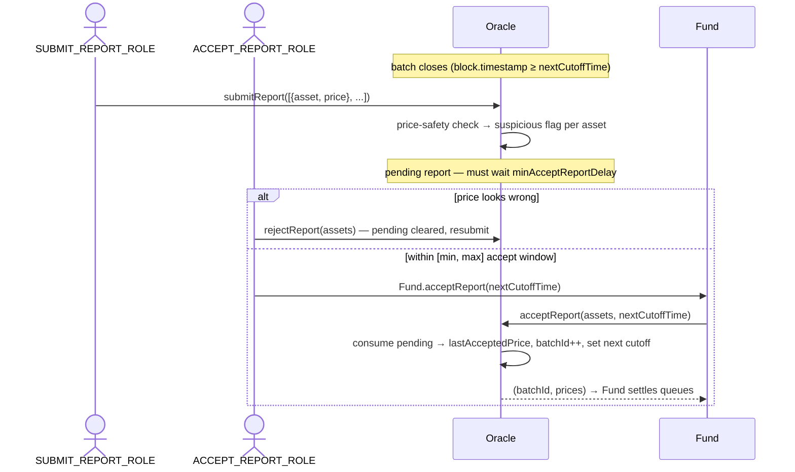

# Oracle

> Source: [`src/Oracle.sol`](../src/Oracle.sol)

## Responsibility

`Oracle` is the fund's **NAV/price reporting and batch clock**. It:

- Defines **batches**: time windows separated by `nextCutoffTime`. Deposit/redeem requests are grouped by batch id, and each batch is priced by exactly one accepted report per asset.
- Receives **price reports** (asset price per share, 1e18-scaled) from an off-chain reporter, holds them as *pending* through a review window, and flags **suspicious** prices using configurable safety bounds.
- Releases accepted prices to the [Fund](Fund.md) during settlement and stores `lastAcceptedPrice` per asset.

Prices use the convention `shares = amount * 1e18 / price` — i.e. `price` is the amount of that asset corresponding to one share (1e18 share-units). `amount` is in the asset's **raw units**, so the reported price must be too: a $1.00 share priced in 6-decimal USDC is reported as `1e6`, not `1e18`.

Admin/reporter functions authorize against the **Fund's** access control (spoke pattern). The accept functions are `onlyFund` — they can only be reached through `Fund.acceptReport` / `Fund.acceptSuspiciousReport`, which adds the settlement orchestration on top.

## Batch semantics

- `currentBatchId` is the batch currently awaiting a report; `getCurrentBatchId()` returns `currentBatchId + 1` once `block.timestamp >= nextCutoffTime`, so **new deposit/redeem requests automatically roll into the next batch** while the closed batch is being priced.
- Accepting a report **advances** `currentBatchId` and requires a new future `nextCutoffTime` to be supplied in the same call.

## Report lifecycle

**Timing rules**

| Rule | Effect |
|---|---|
| `block.timestamp >= nextCutoffTime` | Batch must be closed before submit/accept. |
| `elapsed >= minAcceptReportDelay` (default 1 hour) | Mandatory review window between submit and accept — gives `REJECT_REPORT_ROLE` time to veto a bad price. |
| `elapsed <= maxAcceptReportDelay` (default 7 days) | Stale reports cannot be accepted; resubmit instead. |
| Both delays capped at 30 days, min ≤ max, neither can be 0. | |

**Price safety** (per asset, all checks optional — 0 disables):

| Field | Suspicious when |
|---|---|
| `minPrice` / `maxPrice` | Reported price outside the absolute bounds. |
| `maxAbsoluteDelta` | Change vs `lastAcceptedPrice` exceeds the absolute delta. |
| `maxDeviationBps` | Change vs `lastAcceptedPrice` exceeds the bps deviation. |

A suspicious report is **not rejected** — it stays pending but can only be consumed via `Fund.acceptSuspiciousReport` (a stronger role), or replaced after rejection.

## Function reference

### Reporter / reviewer (roles checked on the Fund)

| Function | Role | Description |
|---|---|---|
| `submitReport(reports[])` | `SUBMIT_REPORT_ROLE` | Submit `{asset, price}` pairs for the closed batch. Runs price-safety checks (result reported in the `ReportSubmitted` event) and stores pending reports. The `suspicious` flag itself is **not stored** — it is re-derived from the current safety config at read/accept time, so a mid-window `setPriceSafety` can never leave a stale flag behind. Reverts on zero price, batch not closed, or an already-accepted report for that asset+batch. Re-submitting overwrites a pending (unaccepted) report and resets its timer. |
| `rejectReport(assets[])` | `REJECT_REPORT_ROLE` | Deletes pending reports for the listed assets so they can be resubmitted. |

### Fund-only (reached via `Fund.acceptReport*`)

| Function | Access | Description |
|---|---|---|
| `acceptReport(assets[], nextCutoffTime)` | `onlyFund` | Verifies batch closed, **no suspicious pending report** among `assets` (suspiciousness evaluated against the safety config at accept time), and every asset is inside its accept window; consumes all pending reports, updates `lastAcceptedPrice`, advances the batch, sets the next cutoff. Returns `(batchId, prices[])`. |
| `acceptSuspiciousReport(assets[], nextCutoffTime)` | `onlyFund` | Same, but skips the suspicious check. |

### Admin setters (roles checked on the Fund)

| Function | Role | Description |
|---|---|---|
| `setPriceSafety(asset, safety)` / `setPriceSafetyBatch(safeties[])` | `SET_PRICE_SAFETY_ROLE` | Configure per-asset safety bounds. `maxDeviationBps ≤ 10000`, `minPrice ≤ maxPrice` when both set. |
| `setNextCutoffTime(t)` | `SET_NEXT_CUTOFF_TIME_ROLE` | Move the current batch's cutoff (must be in the future). Reverts (`BatchAlreadyClosed`) if the existing cutoff has already passed — a closed batch cannot be retroactively reopened. |
| `setMinAcceptReportDelay(d)` | `SET_MIN_ACCEPT_REPORT_DELAY_ROLE` | Adjust the review window (≤ 30 days, ≤ max). |
| `setMaxAcceptReportDelay(d)` | `SET_MAX_ACCEPT_REPORT_DELAY_ROLE` | Adjust the staleness limit (≤ 30 days, ≥ min). |

### Views

| Function | Description |
|---|---|
| `getCurrentBatchId()` | Batch id that new requests fall into (auto-advances at cutoff). |
| `currentBatchId` / `nextCutoffTime` | Raw batch state. |
| `getReport(asset, batchId)` | Accepted report (price) for a batch. |
| `getPendingReport(asset, batchId)` | Pending report (`price`, `suspicious`, `submittedAt`). `suspicious` is derived from the current price-safety config at read time. |
| `lastAcceptedPrice(asset)` | Most recently accepted price — used by risk checks and deviation safety. |
| `priceSafety(asset)` | Configured safety bounds. |
| `minAcceptReportDelay` / `maxAcceptReportDelay` | Current accept window config. |
| `fund()` | The bound Fund. |
