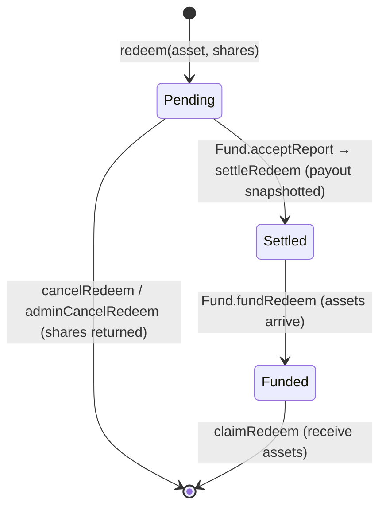

# RedeemQueue

> Source: [`src/RedeemQueue.sol`](../src/RedeemQueue.sol)

## Responsibility

`RedeemQueue` is the **user entrypoint for redeeming fund shares back into assets**. Like deposits, redemptions are batched: users lock shares into the current batch, the batch is priced when the oracle report is accepted, and payouts become claimable once the Fund **funds** the batch with assets.

Redemption has one more stage than deposits because the fund's assets may be deployed in strategies at settlement time — settling a batch fixes *how much* is owed, while funding (a separate, role-gated Fund action) actually delivers the assets.

Admin functions authorize against the **Fund's** access control (spoke pattern — see [AccessControl.md](AccessControl.md)).

## Redeem lifecycle

1. **Request** — user calls `redeem`, choosing which allowed asset they want to be paid in. Shares are transferred into the queue (requires prior ERC20 approval of the share token). `Fund.checkRedeem` → [RiskManager](RiskManager.md) enforces minimums and batch caps. One request per (asset, batch, user).
2. **Cancel** — the user can cancel their current-batch request before settlement and get their shares back. An admin (`CANCEL_REDEEM_REQUEST_ROLE`) can cancel any request in any unsettled batch.
3. **Settle** — during `Fund.acceptReport`, `settleRedeem` transfers the batch's shares to the Fund (which burns them) and **snapshots the asset payout** (`batchAssetTotals`) computed at the accepted price minus exit fee. Because the payout is snapshotted here, later admin changes to exit fee or price cannot change what the batch is owed. The batch is tracked as *settled-but-unfunded*.
4. **Fund** — `FUND_REDEEM_ROLE` calls `Fund.fundRedeem(asset, batchId)`, which transfers the snapshotted amount to the queue and calls `fundRedeem` here, marking the batch claimable.
5. **Claim** — user calls `claimRedeem` and receives `shares * batchAssetTotals / batchRedeemTotals` (pro-rata).

## Function reference

### User actions

| Function | Access | Description |
|---|---|---|
| `redeem(asset, shares)` | anyone | Queue a redemption into the current batch, paid out in `asset`. Transfers `shares` of the fund share token into the queue. Reverts if asset not allowed/paused, shares 0, or a request already exists this batch. |
| `cancelRedeem(asset)` | request owner | Cancel own current-batch request; shares returned. |
| `claimRedeem(asset, batchId)` | request owner | Claim pro-rata assets once the batch is funded. |

### Fund actions

| Function | Access | Description |
|---|---|---|
| `settleRedeem(asset, batchId, assetAmount)` | `onlyFund` | Transfers the batch's shares to the Fund for burning, snapshots `batchAssetTotals[asset][batchId] = assetAmount`, and adds the batch to the unfunded set. No-op bookkeeping if the batch had no requests. |
| `fundRedeem(asset, batchId)` | `onlyFund` | Marks a settled batch as funded (assets were already transferred in by the Fund in the same transaction). Reverts if not settled or already funded. |

### Admin (roles checked on the Fund)

| Function | Role | Description |
|---|---|---|
| `setAllowedAssets(assets[])` | `SET_REDEEM_ALLOWED_ASSETS_ROLE` | Replace the allowed payout-asset list. Reverts if a removed asset has pending current-batch requests. |
| `pause()` / `unpause()` | `PAUSE_REDEEM_ROLE` / `UNPAUSE_REDEEM_ROLE` | Global pause — blocks `redeem`, `cancelRedeem`, `claimRedeem`. |
| `pauseAssets(assets[])` / `unpauseAssets(assets[])` | `PAUSE_REDEEM_ROLE` / `UNPAUSE_REDEEM_ROLE` | Per-asset pause for new redemption requests. |
| `adminCancelRedeem(asset, batchId, user)` | `CANCEL_REDEEM_REQUEST_ROLE` | Cancel any user's request in any unsettled batch; shares returned to the user. |
| `pullAsset(asset, amount)` | `PULL_REDEEM_ASSET_ROLE` | Escape hatch: transfer assets from the queue back to the Fund. |

### Views

| Function | Description |
|---|---|
| `getAllowedAssets()` / `getAssetStatuses()` | Allowed payout assets (+ pause flags). |
| `getRedeemRequest(asset, batchId, investor)` | A single request (`shares`, `timestamp`). |
| `getPendingRedeems(investor)` | The investor's current-batch requests. |
| `getClaimableRedeems(investor)` | The investor's requests in past, **funded** batches. |
| `getUnfundedBatches()` | All settled (asset, batchId) pairs still awaiting `fundRedeem` — the operator's to-do list. |
| `batchRedeemTotals(asset, batchId)` | Total shares queued per asset per batch. |
| `batchAssetTotals(asset, batchId)` | Snapshotted payout per asset per batch (set at settlement). |
| `isBatchFunded(asset, batchId)` | Whether a batch is claimable. |
| `isAssetPaused(asset)` / `fund()` | Pause flag / bound Fund. |
