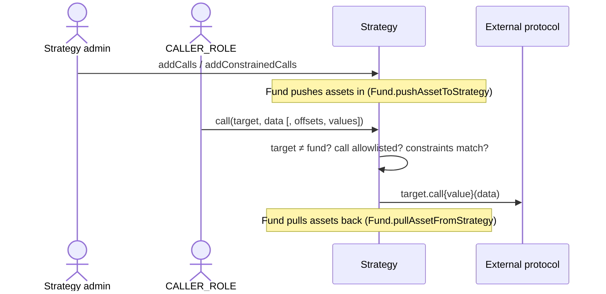

# Strategy

> Source: [`src/Strategy.sol`](../src/Strategy.sol) · [`src/modules/CallValidatorModule.sol`](../src/modules/CallValidatorModule.sol)

## Responsibility

`Strategy` is a **restricted execution wallet for fund capital**. The Fund pushes assets into a strategy, and operators holding `CALLER_ROLE` deploy that capital into external protocols (DEXes, lending markets, …) through a generic `call` interface — but **only calls that have been explicitly allowlisted** can execute.

Key properties:

- Each strategy has its **own access control** (`ACLModule` with its own admin), separate from the Fund's roles. The fund admin and the strategy operator can be different parties.
- The Fund can always **pull assets back** (`pullAsset` is `onlyFund`, invoked via `Fund.pullAssetFromStrategy`), so the operator can deploy capital but never lock the Fund out of it.
- The strategy can **never call the Fund** (`target == fund` is rejected), preventing the operator from using the strategy's `call` to reach Fund-privileged paths.

Strategies are deployed through `Fund.createStrategy` → `FundManager.createStrategyForFund`, which binds the strategy to the fund and puts its proxy under the same ProxyAdmin owner as the Fund's (see [FundManager](FundManager.md)).

## Call allowlisting (`CallValidatorModule`)

Two allowlist granularities, both keyed per **(caller, target, selector)**:

1. **Plain calls** — `addCalls([{caller, target, selector}])` permits `caller` to invoke `target.selector(…)` with *any* arguments.
2. **Constrained calls** — `addConstrainedCalls([...])` additionally pins specific 32-byte words of the calldata: `constrainedOffsets[i]` is a byte offset into the calldata and `constrainedValues[i]` the exact word required there. Example: allow `transfer(address,uint256)` only when the recipient word (offset 4) equals a specific address — the amount stays free.

At execution time the caller picks the matching overload of `call`. For constrained calls, the caller passes the same offsets/values used at registration (they are part of the allowlist key), and the module verifies the actual calldata matches every pinned word.

## Function reference

### Execution

| Function | Access | Description |
|---|---|---|
| `call(target, data)` | `CALLER_ROLE` (payable) | Executes an allowlisted plain call. Reverts if `target` is the Fund, `data` < 4 bytes, the (caller, target, selector) tuple isn't allowlisted, or the underlying call fails. Forwards `msg.value`. Returns the raw result. |
| `call(target, data, constrainedOffsets, constrainedValues)` | `CALLER_ROLE` (payable) | Constrained variant — additionally verifies each pinned calldata word. |
| `receive()` | anyone | Accepts ETH (e.g. unwrapping WETH, protocol payouts). |

### Fund actions

| Function | Access | Description |
|---|---|---|
| `pullAsset(asset, amount)` | `onlyFund` | Transfers assets back to the Fund. Reached via `Fund.pullAssetFromStrategy` (`PULL_FROM_STRATEGY_ROLE` on the Fund). |

### Allowlist management (strategy's own ACL)

| Function | Role | Description |
|---|---|---|
| `addCalls(calls[])` | `ADD_ALLOWED_CALL_ROLE` | Register plain calls. Duplicate registration reverts. |
| `removeCalls(callHashes[])` | `REMOVE_ALLOWED_CALL_ROLE` | Remove plain calls by hash. |
| `addConstrainedCalls(calls[])` | `ADD_ALLOWED_CALL_ROLE` | Register constrained calls (offsets/values lengths must match). |
| `removeConstrainedCalls(callHashes[])` | `REMOVE_ALLOWED_CALL_ROLE` | Remove constrained calls by hash. |
| `grantRoles` / `revokeRoles` | `DEFAULT_ADMIN_ROLE` (strategy admin) | Batch role management from `ACLModule`. |

### Views

| Function | Description |
|---|---|
| `fund()` | The bound Fund. |
| `getAllowedCalls()` / `getAllowedConstrainedCalls()` | All registered call hashes. |
| `getCall(hash)` / `getConstrainedCall(hash)` | Decode a hash back to its registered tuple. |
| `getCallHash(caller, target, selector)` | `keccak256(abi.encode(caller, target, selector))`. |
| `getConstrainedCallHash(caller, target, selector, offsets, values)` | Hash including the constraints. |

## Related

- [StandaloneStrategy](StandaloneStrategy.md) — the same execution engine detached from Fund control, for deploying strategies on a **different chain** than the Fund.
